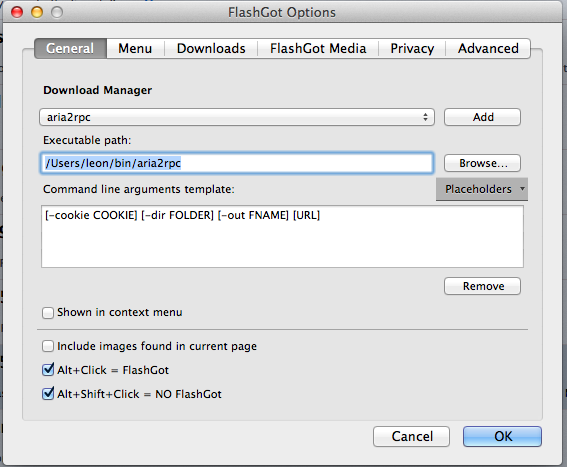

# Add Downloading Tasks through Aria2 RPC

A CLI tool for adding downloading tasks to Aria2 through RPC.  
Usefull for **Firefox** extensions like **Flashgot** who can customize download utilities.



Argument Example:

```sh
aria2rpc -cookie 'id=xxx; name=yyy;' \
-dir /path/to/dest -out filename \
-rpc http://192.168.1.1:6800/jsonrpc \
http://example.org/file.zip
```